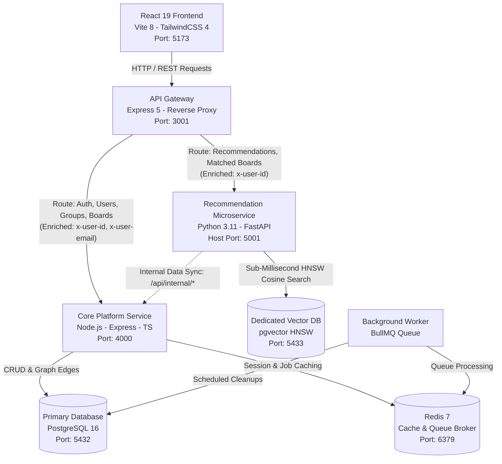

# Synapse — Distributed Skill-Based Collaboration & Peer Discovery Platform

Synapse is a distributed, high-performance web platform designed for college students to showcase their verified technical expertise, discover compatible peers through semantic vector similarity and 2nd-degree social graph traversal, form collaborative project groups, and match with campus opportunities.

---

## System Architecture

The platform follows an event-driven, decoupled **Microservices Architecture**. Below are both the interactive visual diagram and the structural component layout:

### 1. Interactive Architectural Diagram



### 2. Structural Component & Data Flow Map

```text
+-----------------------------------------------------------------------------------+
|                                   CLIENT LAYER                                    |
|   React 19 Frontend (Vite 8, TailwindCSS 4, React Router 7, TanStack Query 5)     |
|   Port: 5173  |  SPA, Manual "Load More" Pagination, Match Compatibility Badges   |
+-----------------------------------------------------------------------------------+
                                          |
                                          | HTTP / REST (Bearer JWT)
                                          v
+-----------------------------------------------------------------------------------+
|                                EDGE / INGRESS LAYER                               |
|   API Gateway (Express 5, http-proxy-middleware)                                  |
|   Port: 3001  |  Central JWT Auth, Header Spoofing Protection, Reverse Proxy      |
+-----------------------------------------------------------------------------------+
                 |                                                  |
                 | /api/auth/**, /api/users/**                      | /api/recommendations/**
                 | /api/connections/**, /api/groups/**              | /api/boards/matched
                 | /api/boards/global, /api/boards/college          | (Enriched: x-user-id)
                 | (Enriched: x-user-id, x-user-email)              |
                 v                                                  v
+--------------------------------------+   +----------------------------------------+
|        CORE PLATFORM SERVICE         |   |      RECOMMENDATION MICROSERVICE       |
|   Node.js, Express 5, TypeScript 7   |   |   Python 3.11, FastAPI                 |
|   Port: 4000 (Internal Docker Net)   |   |   Host: 5001 | Container: 5000         |
|   - Users, Skills, Interests CRUD    |   |   - fastembed (Quantized ONNX SIMD)    |
|   - 2-Hop Graph Traversal (U->V->C)  |<--|   - Multi-Attribute Weighted Vectors   |
|   - Groups, Boards & Join Requests   |   |   - Cosine Distance Nearest Neighbors  |
|   - Secure /api/internal/* Endpoints |   |   - Non-Blocking Background Backfill   |
+--------------------------------------+   +----------------------------------------+
            |                  |                                |
            v                  v                                v
+--------------------+ +---------------+             +--------------------+
|  PRIMARY DATABASE  | |  REDIS CACHE  |             |  VECTOR DATABASE   |
|   PostgreSQL 16    | |    Redis 7    |             |  pgvector / PG16   |
|   Port: 5432       | |   Port: 6379  |             |   Port: 5433       |
| Relational Schema  | | BullMQ Queue  |             | 384-d Embeddings   |
| Users, Edges, Post | | Session State |             | HNSW Cosine Index  |
+--------------------+ +---------------+             +--------------------+
```

---

## Services & How They Operate

### 1. API Gateway (`gateway/`)
- **Technology**: Node.js, Express 5, `http-proxy-middleware`, JWT
- **Port**: `3001` (External entry point for frontend client)
- **Role & Operations**:
  - **Zero-Trust Security Perimeter**: Intercepts all incoming client requests. Strips any incoming `x-user-*` headers to eliminate header spoofing.
  - **Central Authentication**: Verifies JWT access tokens at the edge and extracts claims (`userId`, `email`, `collegeId`).
  - **Header Enrichment**: Forwards verified user identity downstream via trusted internal headers:
    - `x-user-id`: Authenticated user UUID
    - `x-user-email`: Authenticated college email
    - `x-user-college-id`: Verified college ID
  - **Dynamic Reverse Proxy Routing**:
    - Proxies `/api/auth/**`, `/api/users/**`, `/api/connections/**`, `/api/groups/**`, `/api/boards/global`, `/api/boards/college`, and `/api/search/**` to the **Core Service**.
    - Proxies `/api/recommendations/**` and `/api/boards/matched` directly to the **Recommendation Service**.
  - **Resilience**: Features custom proxy error handling (`onProxyError`) to return structured 502 Bad Gateway responses during service restarts instead of hanging connections.

---

### 2. Core Platform Service (`server/`)
- **Technology**: Node.js, Express 5, TypeScript 7, PostgreSQL (`pg`)
- **Port**: `4000` (Internal Docker network)
- **Role & Operations**:
  - **Business Transactions & Entity CRUD**: Manages user accounts, college domains, user skills, user interests, work portfolios, and project groups.
  - **Connection Graph & Symmetric Edge Tracking**: Maintains mutual connection states and symmetrical connection edges in PostgreSQL for instant degree computation.
  - **2-Hop Social Graph Traversal ($U \rightarrow V \rightarrow C$)**:
    - Executes SQL graph queries over `connection_edges` to identify friends-of-friends.
    - Computes mutual connection counts and resolves bridge connection identities (e.g. *"2 mutual connections via Priya Patel"*).
  - **Board Postings Management**: Creates and updates recruitment postings, tracks open vs filled slots, manages join requests, and executes expired posting cleanups.
  - **Internal Data APIs (`/api/internal/*`)**: Provides secure endpoints consumed by the Recommendation Service for vector backfilling and real-time candidate fetching:
    - `GET /api/internal/users-data`: Profile data for embedding calculation.
    - `GET /api/internal/boards-data`: Board posting data for embedding calculation.
    - `GET /api/internal/connections/:userId`: IDs of existing connections to exclude from recommendations.
    - `GET /api/internal/second-degree-candidates/:userId`: Graph candidates for hybrid ranking.

---

### 3. Recommendation & Vector Matching Microservice (`recommendation-service/`)
- **Technology**: Python 3.11, FastAPI, `fastembed` (quantized ONNX SIMD runtime), `psycopg2`, `pgvector`
- **Port**: Host `5001` (Container: `5000`)
- **Role & Operations**:
  - **Ultra-Lightweight Vector Inference**:
    - Employs **`fastembed`** using `BAAI/bge-small-en-v1.5` (384-dimensional dense vectors) executed on ONNX Runtime.
    - Eliminates heavyweight PyTorch/CUDA dependencies (>2.5 GB download reduced to ~60 MB), achieving sub-15ms vector computation.
  - **Weighted Multi-Attribute Fusion**:
    - Combines multiple profile aspects into dense semantic representations using weighted fusion:
      - **Technical Skills**: 45% weight ($w_1 = 0.45$)
      - **College & Campus**: 25% weight ($w_2 = 0.25$)
      - **Interests & Domains**: 20% weight ($w_3 = 0.20$)
      - **Bio, Year, Intent**: 10% weight ($w_4 = 0.10$)
  - **Semantic Peer Matching (`/recommendations/similarity`)**:
    - Uses cosine distance queries (`1 - (ue.embedding <=> target.embedding)`) against `user_embeddings`.
    - Automatically excludes self and already-connected users.
    - Calculates compatibility match percentages: $\text{matchPercentage} = \text{round}(\text{similarityScore} \times 100)$.
  - **Hybrid 2nd-Degree Ranking (`/recommendations/second-degree`)**:
    - Takes 2nd-degree candidates from the Core Service's graph traversal.
    - Ranks candidates using a hybrid score formula:
      $$\text{Score} = (\text{mutualCount} \times 100.0) + (\text{similarityScore} \times 50.0)$$
    - Omits percentage badges to keep 2nd-degree recommendations focused strictly on social proof (mutual friends).
  - **Semantic Board Matching (`/boards/matched`)**:
    - Matches active user profile embeddings against board posting requirements (roles, required skills, project descriptions).
    - Automatically excludes postings created by the user themselves.
    - Returns semantic match percentages for opportunities created by other students.
  - **Non-Blocking Asynchronous Sync**:
    - Runs automated startup and background backfills on separate worker threads with thread-safe locks, ensuring zero API blocking or gateway timeouts.

---

### 4. Dedicated Vector Database (`synapse-vectordb`)
- **Technology**: PostgreSQL 16 with `pgvector` extension (`pgvector/pgvector:pg16`)
- **Port**: `5433` (Internal: `5432`)
- **Role & Operations**:
  - **Physical Separation**: Vector embeddings and high-dimensional indexes run on a physically isolated PostgreSQL instance with its own dedicated volume (`vector_pgdata`), completely separated from transactional business data.
  - **Tables**:
    - `user_embeddings`: `user_id UUID PRIMARY KEY`, `embedding vector(384)`, `metadata JSONB`, `updated_at`.
    - `board_posting_embeddings`: `posting_id UUID PRIMARY KEY`, `creator_id UUID`, `embedding vector(384)`, `metadata JSONB`, `updated_at`.
  - **Indexing**: Optimized **HNSW (Hierarchical Navigable Small World)** cosine distance indexes (`vector_cosine_ops`) with parameters $M=16, \text{ef\_construction}=64$ for sub-millisecond approximate nearest neighbor (ANN) retrieval.

---

### 5. Primary Relational Database (`synapse-postgres`)
- **Technology**: PostgreSQL 16 Alpine
- **Port**: `5432`
- **Role & Operations**:
  - Houses core relational entities: `users`, `colleges`, `skills`, `interests`, `user_skills`, `user_interests`, `work_items`, `connections`, `connection_edges`, `groups`, `group_members`, `board_postings`, `join_requests`.
  - Enforces foreign keys, unique email constraints, and relational cascade deletes.

---

### 6. Background Worker & Queue (`synapse-worker` & `synapse-redis`)
- **Technology**: Redis 7, BullMQ
- **Port**: `6379`
- **Role & Operations**:
  - Asynchronous background queue processing for non-interactive jobs, notifications, and scheduled database cleanups.

---

### 7. React Web Client (`client/`)
- **Technology**: React 19, Vite 8, TailwindCSS 4, React Router 7, TanStack Query 5
- **Port**: `5173`
- **Role & Operations**:
  - **Manual "Load More" Pagination**: Replaced unpredictable infinite scroll with an explicit "Load More" button across all lists. New batches of 30 items are appended only when the user clicks the button.
  - **Dynamic Compatibility Badges**:
    - Displays styled emerald match percentage badges (e.g. `93% Match`, `69% Match`) on **Similarity Recommendations** and **Matched Board Postings**.
    - Automatically hides percentage badges on **2nd-degree network recommendations** (prioritizing mutual connection badges) and on the user's **own created postings**.
  - **Instant Skill & Interest Suggestions**: Pre-loads suggestion chips upon clicking "+ Add Skill" or "+ Add Interest", with live search filtering and custom skill creation.
  - **Unmasked Password Inputs**: Login and registration forms display passwords clearly in plain text for transparent testing.

---

## Service Port Mapping

| Service Name | Container Name | Host Port | Internal Port | Description |
|---|---|---|---|---|
| **Client** | `synapse-client` | `5173` | `5173` | React / Vite Frontend UI |
| **API Gateway** | `synapse-gateway` | `3001` | `3001` | Central Edge Proxy & Auth |
| **Core Service** | `synapse-core-service` | `4000` | `4000` | Platform Backend & Business Logic |
| **Recommendation Service** | `synapse-recommendation-service` | `5001` | `5000` | Python FastAPI Vector Matching Engine |
| **Primary Database** | `synapse-postgres` | `5432` | `5432` | Relational PostgreSQL Database |
| **Vector Database** | `synapse-vectordb` | `5433` | `5432` | Dedicated pgvector Database |
| **Redis** | `synapse-redis` | `6379` | `6379` | Cache & BullMQ Message Queue |

---

## API Routes & Gateway Routing Map

| External Route | Method | Downstream Target | Auth Required | Key Features / Headers |
|---|---|---|---|---|
| `/api/auth/login` | POST | Core Service (`:4000`) | No | Email + password login |
| `/api/auth/signup` | POST | Core Service (`:4000`) | No | Campus domain verification |
| `/api/users/me` | GET, PUT | Core Service (`:4000`) | Yes | Profile view & edits |
| `/api/users/skills` | GET | Core Service (`:4000`) | No | Instant skill taxonomy typeahead |
| `/api/users/interests`| GET | Core Service (`:4000`) | No | Instant interest taxonomy typeahead |
| `/api/connections/**`| ALL | Core Service (`:4000`) | Yes | Requests, accepts, graph state |
| `/api/groups/**` | ALL | Core Service (`:4000`) | Yes | Team management |
| `/api/boards/global` | GET | Core Service (`:4000`) | Yes | Filterable campus board postings |
| `/api/boards/college`| GET | Core Service (`:4000`) | Yes | Postings from user's college |
| `/api/boards/my-postings` | GET | Core Service (`:4000`) | Yes | Own postings (no match percentage) |
| `/api/boards/matched`| GET | Recommendation Service (`:5000`)| Yes | Vector semantic match + percentage badge |
| `/api/recommendations/similarity` | GET | Recommendation Service (`:5000`)| Yes | Vector peer cosine similarity + percentage badge |
| `/api/recommendations/second-degree` | GET | Recommendation Service (`:5000`)| Yes | 2-hop graph candidates + hybrid ranking |

---

## Getting Started

### Prerequisites
- **Docker & Docker Compose** installed
- **Node.js 20+** (for optional local package commands)
- **Git**

### 1. Launch the Full Microservices Suite
Clone the repository and spin up all 8 microservice containers:

```bash
docker compose up -d
```

Docker Compose will build and launch:
1. `synapse-postgres` (Port 5432)
2. `synapse-vectordb` (Port 5433)
3. `synapse-redis` (Port 6379)
4. `synapse-core-service` (Port 4000)
5. `synapse-recommendation-service` (Port 5001)
6. `synapse-gateway` (Port 3001)
7. `synapse-worker` (Background jobs)
8. `synapse-client` (Port 5173)

### 2. Access the Application
- Open your browser to **`http://localhost:5173`**.
- Default Demo Account:
  - **Email**: `alex@iitb.ac.in`
  - **Password**: `Password123!`
  - **College**: Indian Institute of Technology Bombay

---

## Development & Maintenance Commands

### Check Health of All Services
```bash
# Gateway Health Check
curl http://localhost:3001/api/health

# Recommendation Service Vector Counts
curl http://localhost:5001/health
```

### Inspect Container Logs
```bash
# Recommendation Service Logs
docker compose logs recommendation-service --tail 50 -f

# Core Service Logs
docker compose logs core-service --tail 50 -f

# Gateway Logs
docker compose logs gateway --tail 50 -f
```

### Rebuild Frontend Client
```bash
cd client
npm run build
```

### Rebuild Backend Core Service
```bash
cd server
npm run build
```

### Trigger On-Demand Vector Database Sync
```bash
curl -X POST http://localhost:5001/internal/backfill
```

---

## License
Private & Confidential — All rights reserved.
