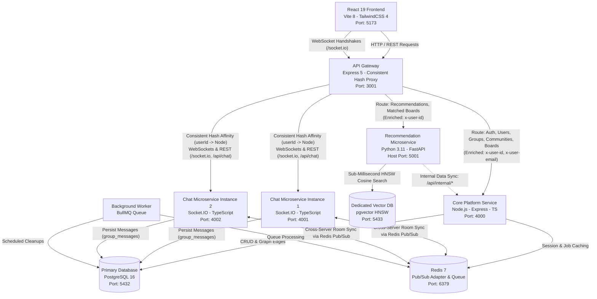

# Synapse - Distributed Skill-Based Collaboration & Peer Discovery Platform

Synapse is a distributed, high-performance web platform designed for college students to showcase their verified technical expertise, discover compatible peers through semantic vector similarity and 2nd-degree social graph traversal, form collaborative project groups, participate in global campus communities, and match with project opportunities.

---

## System Architecture

The platform follows an event-driven, decoupled **Microservices Architecture**. Below are both the interactive visual diagram and the structural component layout:

### 1. Interactive Architectural Diagram



### 2. Structural Component & Data Flow Map

```text
+-----------------------------------------------------------------------------------+
|                                   CLIENT LAYER                                    |
|   React 19 Frontend (Vite 8, TailwindCSS 4, React Router 7, TanStack Query 5)     |
|   Port: 5173  |  SPA, Real-Time Group & Community Chat, Match Compatibility Badges|
+-----------------------------------------------------------------------------------+
                                          |
                                          | HTTP / REST & WebSockets (Bearer JWT)
                                          v
+-----------------------------------------------------------------------------------+
|                                EDGE / INGRESS LAYER                               |
|   API Gateway (Express 5, Consistent Hash Ring Load Balancer)                     |
|   Port: 3001  |  Central JWT Auth, Reverse Proxy, User Affinity & Sticky Sessions |
+-----------------------------------------------------------------------------------+
        |                                 |                                  |
        | /api/auth/**, /api/users/**     | /api/recommendations/**          | /socket.io/** (WebSockets)
        | /api/connections/**             | /api/boards/matched              | /api/chat/** (REST History)
        | /api/groups/**                  | (Enriched: x-user-id)            | (Consistent Hashing: userId -> Node)
        | /api/communities/**             |                                  |
        | /api/boards/**                  |                                  |
        v                                 v                                  v
+-----------------------+     +-----------------------+     +-----------------------------------+
|     CORE SERVICE      |     | RECOMMENDATION SERVICE|     |     CHAT MICROSERVICE CLUSTER     |
| Node.js, Express, TS  |     | Python 3.11, FastAPI  |     | Node.js, TypeScript, Socket.IO    |
| Port: 4000 (Internal) |     | Host: 5001 | Cont: 5000 |   | chat-1 (:4001) | chat-2 (:4002)   |
| - Users, Skills CRUD  |     | - fastembed ONNX SIMD |     | - Group & Community Chat Rooms    |
| - 2-Hop Graph Queries |<----| - Multi-Attr Vectors  |     | - Redis Pub/Sub Cross-Server Sync |
| - Groups & Communities|     | - HNSW Cosine Search  |     | - User-to-Server Cache Stickiness |
+-----------------------+     +-----------------------+     +-----------------------------------+
        |          \                      |                         |                 |
        |           \                     |                         |                 |
        v            v                    v                         v                 v
+---------------+  +--------------------+  +--------------------+  +--------------------+
|  PRIMARY DB   |  |    REDIS CACHE     |  |     VECTOR DB      |  |  POSTGRES DB       |
| PostgreSQL 16 |  |    Redis 7         |  |   pgvector / PG16  |  | Table:             |
| Port: 5432    |  |    Port: 6379      |  |   Port: 5433       |  | group_messages     |
| Relational    |  | Socket.IO Adapter  |  | 384-d Embeddings   |  | Relational Cascade |
| Core Entities |  | BullMQ Queue       |  | HNSW Cosine Index  |  | Chat History       |
+---------------+  +--------------------+  +--------------------+  +--------------------+
```

---

## Services & How They Operate

### 1. API Gateway (`gateway/`)
- **Technology**: Node.js, Express 5, `http-proxy-middleware`, JWT, Consistent Hash Ring
- **Port**: `3001` (External entry point for frontend client)
- **Role & Operations**:
  - **Zero-Trust Security Perimeter**: Intercepts all incoming client requests. Strips any incoming `x-user-*` headers to eliminate header spoofing.
  - **Central Authentication**: Verifies JWT access tokens at the edge and extracts claims (`userId`, `email`, `collegeId`).
  - **Header Enrichment**: Forwards verified user identity downstream via trusted internal headers:
    - `x-user-id`: Authenticated user UUID
    - `x-user-email`: Authenticated college email
    - `x-user-college-id`: Verified college ID
  - **Consistent Hash Ring Load Balancer (User-to-Server Affinity)**:
    - Employs a 100-virtual-node consistent hash ring to route WebSocket handshakes (`/socket.io`) and REST requests (`/api/chat`) deterministically across the chat microservice cluster (`chat-service-1` and `chat-service-2`).
    - Maps user identity (`userId` from JWT, handshake auth, query parameter, or client IP) to the nearest hash ring position.
    - **Reconnection Stickiness**: Disconnecting and reconnecting guarantees that the user returns to the exact same server instance.
    - **Cache Protection on Cluster Scaling**: When nodes are added or removed, only $1/N$ of keys migrate. Existing users stay pinned to their active server node, preventing in-memory local caches from becoming invalid or thrashing.
  - **Dynamic Reverse Proxy Routing**:
    - Proxies `/api/auth/**`, `/api/users/**`, `/api/connections/**`, `/api/groups/**`, `/api/communities/**`, `/api/boards/global`, `/api/boards/college`, and `/api/search/**` to the **Core Service**.
    - Proxies `/api/recommendations/**` and `/api/boards/matched` directly to the **Recommendation Service**.
    - Tunnels WebSocket `Upgrade: websocket` requests for `/socket.io` to the consistent-hash-selected chat instance.
    - Proxies `/api/chat/**` to the consistent-hash-selected chat instance.
  - **Resilience**: Features custom proxy error handling (`onProxyError`) to return structured 502 Bad Gateway responses during service restarts instead of hanging connections.

---

### 2. Core Platform Service (`server/`)
- **Technology**: Node.js, Express 5, TypeScript 7, PostgreSQL (`pg`)
- **Port**: `4000` (Internal Docker network)
- **Role & Operations**:
  - **Business Transactions & Entity CRUD**: Manages user accounts, college domains, user skills, user interests, work portfolios, project groups, and permanent student communities.
  - **College & Institution Directory**:
    - Supports institution search (`GET /api/users/colleges?q=...`) and automated resolution during profile updates (`PUT /api/users/me`).
    - Automatically provisions clean institutional domains when users introduce previously uncataloged universities.
  - **Student Engineering Groups & Lifecycle**:
    - Project groups with configurable visibility (`global` or `college`).
    - Member management, administrative transfer, and dedicated leave group workflows (`POST /api/groups/:id/leave`).
  - **Permanent Global Communities**:
    - High-capacity interest networks (`max_members = 1000`) with global visibility.
    - Unlike project groups, communities are permanent and do not require ephemeral recruitment posters.
    - Endpoints for joining, leaving, listing members, and community discovery (`/api/communities/**`).
  - **Connection Graph & Symmetric Edge Tracking**: Maintains mutual connection states and symmetrical connection edges in PostgreSQL for instant degree computation.
  - **2-Hop Social Graph Traversal ($U \rightarrow V \rightarrow C$)**:
    - Executes SQL graph queries over `connection_edges` to identify friends-of-friends.
    - Computes mutual connection counts and resolves bridge connection identities (for example, *"2 mutual connections via Priya Patel"*).
  - **Board Postings Management**: Creates and updates recruitment postings, tracks open vs filled slots, manages join requests, and executes expired posting cleanups.
  - **Internal Data APIs (`/api/internal/*`)**: Provides secure endpoints consumed by the Recommendation Service for vector backfilling and real-time candidate fetching:
    - `GET /api/internal/users-data`: Profile data for embedding calculation.
    - `GET /api/internal/boards-data`: Board posting data for embedding calculation.
    - `GET /api/internal/connections/:userId`: IDs of existing connections to exclude from recommendations.
    - `GET /api/internal/second-degree-candidates/:userId`: Graph candidates for hybrid ranking.

---

### 3. Recommendation & Vector Matching Microservice (`recommendation-service/`)
- **Technology**: Python 3.11, FastAPI, `fastembed` (quantized ONNX SIMD runtime), `psycopg2`, `pgvector`
- **Port**: Host `5001` (Container: `5000`)
- **Role & Operations**:
  - **Ultra-Lightweight Vector Inference**:
    - Employs **`fastembed`** using `BAAI/bge-small-en-v1.5` (384-dimensional dense vectors) executed on ONNX Runtime.
    - Eliminates heavyweight PyTorch/CUDA dependencies (>2.5 GB download reduced to ~60 MB), achieving sub-15ms vector computation.
  - **Weighted Multi-Attribute Fusion**:
    - Combines multiple profile aspects into dense semantic representations using weighted fusion:
      - **Technical Skills**: 45% weight ($w_1 = 0.45$)
      - **College & Campus**: 25% weight ($w_2 = 0.25$)
      - **Interests & Domains**: 20% weight ($w_3 = 0.20$)
      - **Bio, Year, Intent**: 10% weight ($w_4 = 0.10$)
  - **Semantic Peer Matching (`/recommendations/similarity`)**:
    - Uses cosine distance queries (`1 - (ue.embedding <=> target.embedding)`) against `user_embeddings`.
    - Automatically excludes self and already-connected users.
    - Calculates compatibility match percentages: $\text{matchPercentage} = \text{round}(\text{similarityScore} \times 100)$.
  - **Hybrid 2nd-Degree Ranking (`/recommendations/second-degree`)**:
    - Takes 2nd-degree candidates from the Core Service's graph traversal.
    - Ranks candidates using a hybrid score formula:
      $$\text{Score} = (\text{mutualCount} \times 100.0) + (\text{similarityScore} \times 50.0)$$
    - Omits percentage badges to keep 2nd-degree recommendations focused strictly on social proof (mutual friends).
  - **Semantic Board Matching (`/boards/matched`)**:
    - Matches active user profile embeddings against board posting requirements (roles, required skills, project descriptions).
    - Automatically excludes postings created by the user themselves.
    - Returns semantic match percentages for opportunities created by other students.
  - **Non-Blocking Asynchronous Sync**:
    - Runs automated startup and background backfills on separate worker threads with thread-safe locks, ensuring zero API blocking or gateway timeouts.

---

### 4. Real-Time Chat Microservice Cluster (`chat-service/`)
- **Technology**: Node.js, Express, TypeScript, Socket.IO, `@socket.io/redis-adapter`, `ioredis`, PostgreSQL (`pg`)
- **Ports**: 
  - `chat-service-1`: Port `4001` (Internal instance: `chat-1`)
  - `chat-service-2`: Port `4002` (Internal instance: `chat-2`)
- **Role & Operations**:
  - **Stateful Socket Isolation**: Completely decouples stateful, persistent TCP WebSocket connections from stateless HTTP REST traffic in the Core Platform Service.
  - **Multi-Instance Horizontal Scaling**: Runs multiple instances concurrently. Additional replicas can be added dynamically with zero code changes.
  - **Cross-Server Synchronization via Redis Pub/Sub**:
    - Connected via `@socket.io/redis-adapter` through `ioredis` publisher and subscriber instances.
    - When a user on `chat-service-1` broadcasts a message to room `group:<id>`, Redis Pub/Sub distributes the packet across the entire cluster so peers connected to `chat-service-2` receive the event in real time.
  - **Unified Group & Community Real-Time Messaging**:
    - Project groups (`is_community = FALSE`) and student communities (`is_community = TRUE`) use a single unified room model: `group:<id>`.
    - Enforces relational authorization against `group_members` in PostgreSQL before permitting any user to join a room or dispatch messages.
  - **Message Persistence & Keyset Pagination**:
    - Real-time messages are durably stored in PostgreSQL table `group_messages`.
    - Message history is retrieved chronologically via `GET /api/chat/groups/:groupId/messages` with sender metadata (`name`, `avatar_url`) and cursor pagination.
  - **Ephemeral Real-Time Interactions**:
    - Ephemeral typing indicators (`typing` -> `user_typing`) broadcast across server nodes via Redis without incurring database write overhead.
    - Sockets auto-join a private personal channel `user:<userId>` for directed alerts and notifications.

---

### 5. Dedicated Vector Database (`synapse-vectordb`)
- **Technology**: PostgreSQL 16 with `pgvector` extension (`pgvector/pgvector:pg16`)
- **Port**: `5433` (Internal: `5432`)
- **Role & Operations**:
  - **Physical Separation**: Vector embeddings and high-dimensional indexes run on a physically isolated PostgreSQL instance with its own dedicated volume (`vector_pgdata`), completely separated from transactional business data.
  - **Tables**:
    - `user_embeddings`: `user_id UUID PRIMARY KEY`, `embedding vector(384)`, `metadata JSONB`, `updated_at`.
    - `board_posting_embeddings`: `posting_id UUID PRIMARY KEY`, `creator_id UUID`, `embedding vector(384)`, `metadata JSONB`, `updated_at`.
  - **Indexing**: Optimized **HNSW (Hierarchical Navigable Small World)** cosine distance indexes (`vector_cosine_ops`) with parameters $M=16, \text{ef\_construction}=64$ for sub-millisecond approximate nearest neighbor (ANN) retrieval.

---

### 6. Primary Relational Database (`synapse-postgres`)
- **Technology**: PostgreSQL 16 Alpine
- **Port**: `5432`
- **Role & Operations**:
  - Houses core relational entities: `users`, `colleges`, `skills`, `interests`, `user_skills`, `user_interests`, `work_items`, `connections`, `connection_edges`, `groups`, `group_members`, `communities`, `community_members`, `board_postings`, `join_requests`, and `group_messages`.
  - Enforces foreign keys, unique email constraints, and relational cascade deletes.

---

### 7. Background Worker & Queue (`synapse-worker` & `synapse-redis`)
- **Technology**: Redis 7, BullMQ
- **Port**: `6379`
- **Role & Operations**:
  - Asynchronous background queue processing for non-interactive jobs, notifications, and scheduled database cleanups.

---

### 8. React Web Client (`client/`)
- **Technology**: React 19, Vite 8, TailwindCSS 4, React Router 7, TanStack Query 5, Socket.IO Client
- **Port**: `5173`
- **Role & Key Features**:
  - **Strict Restraint-Based Design Palette**:
    - Canvas `#F7F6F3`, card surfaces `#FFFFFF`, primary text `#1A1A1A`, hairline 1px borders `#E5E2DC`, and Deep Forest Green `#1E3F20` (`primary-600`) accent.
    - Geometric border radiuses (`rounded-lg`), zero heavy drop shadows, zero purple gradients, zero cursor animations, and zero emojis.
  - **Unified Component Switchers (`PageTabButton`)**:
    - Standardized card-style switcher buttons deployed uniformly across `#requests`, `#peers`, `#recommendation`, `#board`, and `#communities`.
  - **Unified Requests Hub (`/requests`)**:
    - Consolidates all inbound and outbound requests into a single interface with four distinct tabs:
      1. `#groupInvites`: Direct invitations from group administrators.
      2. `#myGroupRequest`: Inbound join requests submitted to groups administered by the user.
      3. `#incomingConnectionRequests`: Direct 1-on-1 connection requests received from peers.
      4. `#sentConnectionRequests`: Direct 1-on-1 connection requests dispatched to peers.
    - Retains approved requests in place with an updated "Approved" state indicator rather than disappearing unexpectedly.
  - **Peers Navigation Sequence (`/connections`)**:
    - Structured tab order:
      1. `#connections`: Direct 1st-degree student connections.
      2. `#secondDegree`: 2nd-degree friends-of-friends network.
      3. `#filter`: Comprehensive student directory with multi-attribute filtering.
  - **Communities Hub (`/communities`)**:
    - Dedicated space to discover, join, and manage permanent student interest networks.
    - Includes `#allCommunities`, `#myCommunities`, and `#searchCommunities`.
  - **Synchronized Group & Community Empty States**:
    - Standardized empty state containers and action buttons across `#myGroups` and `#myCommunities` on `HomePage.tsx`.
    - Integrated "Browse Project Board" button directly in `#myGroups` header.
  - **Board & Recruitment Postings (`/boards`)**:
    - Accessible "Create Post" button in header linked to posting and group initialization workflows.
    - Supports global postings (`#all`), campus postings (`#myCollege`), own postings (`#byMe`), and keyword search (`#searchPost`).
  - **Profile College & Institution Management**:
    - Displays institution affiliation with clean `AcademicCapIcon` badge.
    - Includes interactive college selector with autocomplete datalist and support for custom institution entry.
  - **Manual "Load More" Pagination**: Replaced unpredictable infinite scroll with an explicit "Load More" button across all lists. New batches of 30 items are appended only when the user clicks the button.
  - **Dynamic Compatibility Badges**:
    - Displays styled emerald match percentage badges (for example, `93% Match`, `69% Match`) on **Similarity Recommendations** and **Matched Board Postings**.
    - Automatically hides percentage badges on **2nd-degree network recommendations** (prioritizing mutual connection badges) and on the user's **own created postings**.
  - **Real-Time Group & Community Chat (`GroupChat.tsx`)**:
    - Embedded real-time discussion within both project groups and campus communities.
    - Features auto-scroll, message stream, active server node badge (`chat-1`, `chat-2`), typing indicators, and real-time connectivity status.
    - Restricts discussion to verified group or community members with clean access gates.

---

## Service Port Mapping

| Service Name | Container Name | Host Port | Internal Port | Description |
|---|---|---|---|---|
| **Client** | `synapse-client` | `5173` | `5173` | React / Vite Frontend UI |
| **API Gateway** | `synapse-gateway` | `3001` | `3001` | Central Edge Proxy, Auth & Consistent Hash Ring |
| **Core Service** | `synapse-core-service` | `4000` | `4000` | Platform Backend & Business Logic |
| **Recommendation Service** | `synapse-recommendation-service` | `5001` | `5000` | Python FastAPI Vector Matching Engine |
| **Chat Service 1** | `synapse-chat-service-1` | `4001` | `4001` | Real-Time Chat Microservice Instance 1 |
| **Chat Service 2** | `synapse-chat-service-2` | `4002` | `4002` | Real-Time Chat Microservice Instance 2 |
| **Primary Database** | `synapse-postgres` | `5432` | `5432` | Relational PostgreSQL Database |
| **Vector Database** | `synapse-vectordb` | `5433` | `5432` | Dedicated pgvector Database |
| **Redis** | `synapse-redis` | `6379` | `6379` | Cache, Pub/Sub Adapter & BullMQ Queue |

---

## API Routes & Gateway Routing Map

| External Route | Method | Downstream Target | Auth Required | Key Features / Headers |
|---|---|---|---|---|
| `/api/auth/login` | POST | Core Service (`:4000`) | No | Email + password login |
| `/api/auth/signup` | POST | Core Service (`:4000`) | No | Campus domain verification |
| `/api/users/me` | GET, PUT | Core Service (`:4000`) | Yes | Profile view, college selection & updates |
| `/api/users/colleges` | GET | Core Service (`:4000`) | No | Academic institution directory query |
| `/api/users/skills` | GET | Core Service (`:4000`) | No | Instant skill taxonomy typeahead |
| `/api/users/interests` | GET | Core Service (`:4000`) | No | Instant interest taxonomy typeahead |
| `/api/connections/**` | ALL | Core Service (`:4000`) | Yes | Requests, accepts, declines, graph state |
| `/api/groups/**` | ALL | Core Service (`:4000`) | Yes | Team creation, members, admin actions |
| `/api/groups/:id/leave` | POST | Core Service (`:4000`) | Yes | Leave group membership |
| `/api/communities/**` | ALL | Core Service (`:4000`) | Yes | Permanent global interest societies |
| `/api/boards/global` | GET | Core Service (`:4000`) | Yes | Filterable campus board postings |
| `/api/boards/college` | GET | Core Service (`:4000`) | Yes | Postings from user's college |
| `/api/boards/my-postings` | GET | Core Service (`:4000`) | Yes | Own postings (no match percentage) |
| `/api/recommendations/similarity` | GET | Recommendation Service (`:5000`) | Yes | Vector peer cosine similarity + percentage badge |
| `/api/recommendations/second-degree` | GET | Recommendation Service (`:5000`) | Yes | 2-hop graph candidates + hybrid ranking |
| `/api/boards/matched` | GET | Recommendation Service (`:5000`) | Yes | Vector semantic match + percentage badge |
| `/socket.io/**` | WS / GET | Chat Cluster (`:4001`, `:4002`) | Yes (Handshake) | Real-Time WebSocket stream, Consistent Hashing |
| `/api/chat/groups/:groupId/messages` | GET | Chat Cluster (`:4001`, `:4002`) | Yes | Chronological message history with pagination |
| `/api/chat/health` | GET | Chat Cluster (`:4001`, `:4002`) | No | Chat service cluster node status |

---

## Getting Started

### Prerequisites
- **Docker & Docker Compose** installed
- **Node.js 20+** (for optional local package commands)
- **Git**

### 1. Launch the Full Microservices Suite
Clone the repository and spin up all microservice containers:

```bash
docker compose up -d
```

Docker Compose will build and launch:
1. `synapse-postgres` (Port 5432)
2. `synapse-vectordb` (Port 5433)
3. `synapse-redis` (Port 6379)
4. `synapse-core-service` (Port 4000)
5. `synapse-recommendation-service` (Port 5001)
6. `synapse-chat-service-1` (Port 4001)
7. `synapse-chat-service-2` (Port 4002)
8. `synapse-gateway` (Port 3001)
9. `synapse-worker` (Background jobs)
10. `synapse-client` (Port 5173)

### 2. Access the Application
- Open your browser to **`http://localhost:5173`**.
- Default Demo Account:
  - **Email**: `alex@iitb.ac.in`
  - **Password**: `Password123!`
  - **College**: Indian Institute of Technology Bombay

---

## Development & Maintenance Commands

### Check Health of All Services
```bash
# Gateway Health Check
curl http://localhost:3001/api/health

# Recommendation Service Vector Counts
curl http://localhost:5001/health

# Chat Service Cluster Nodes Health
curl http://localhost:4001/api/chat/health
curl http://localhost:4002/api/chat/health
```

### Inspect Container Logs
```bash
# Chat Service Cluster Logs
docker compose logs chat-service-1 --tail 50 -f
docker compose logs chat-service-2 --tail 50 -f

# Recommendation Service Logs
docker compose logs recommendation-service --tail 50 -f

# Core Service Logs
docker compose logs core-service --tail 50 -f

# Gateway Logs
docker compose logs gateway --tail 50 -f
```

### Rebuild Frontend Client
```bash
cd client
npm run build
```

### Rebuild Backend Core Service
```bash
cd server
npm run build
```

### Rebuild Chat Microservice
```bash
cd chat-service
npm run build
```

### Trigger On-Demand Vector Database Sync
```bash
curl -X POST http://localhost:5001/internal/backfill
```

---

## License
Private & Confidential: All rights reserved.

